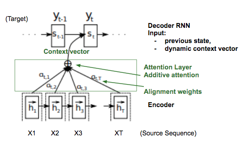

# Attention Model

In a sequence-to-sequence model, the traditional approach is to run the input through a series of RNN/GRU/LSTM units which **memorizes** the entire input sequence. This is the encoding part of the network, it outputs a single vector which should then pass the entire information about the input sequence to a decoder which decodes to give the output sequence.

As we can see this of model fails when a very long sequence is given since its **hard to memorize the entire input**. Thus we use a much powerful model called **Attention Model.** In an attention model, to generate the first output word, we just need to look at the first few words of the input and we don't need to look very deep in the input sequence. Thus we can compute some **attention weights,** alpha^{<t, t'>} which tells how **much attention we need to pay** for a specific input word-**t'** when generating a specific output word-**t**.

